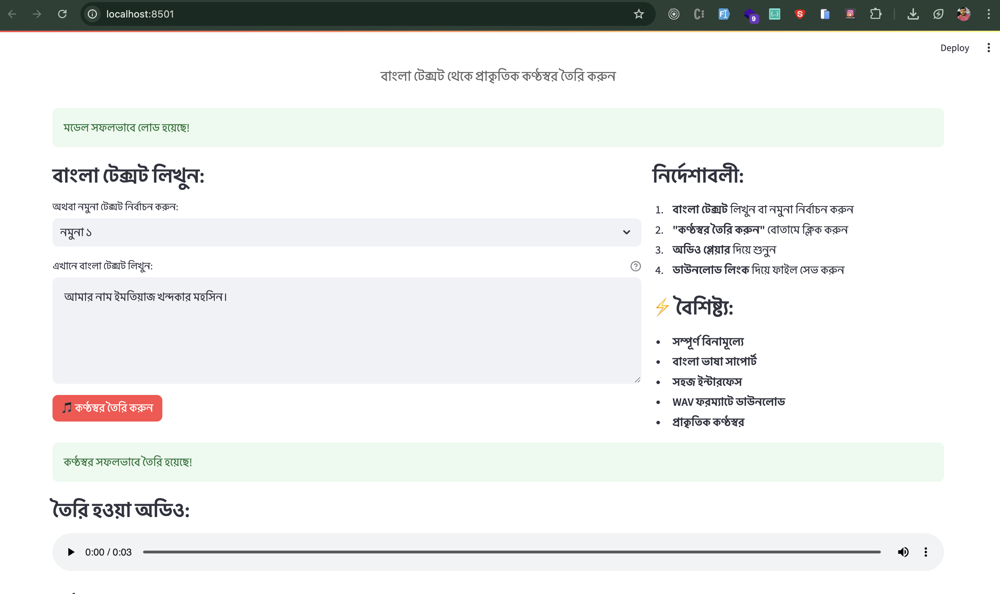

## Developed by Imtiaz Khandoker(Mohsin)

# First, install system dependencies

# Install required audio libraries

brew install libsndfile
brew install sox

# Create virtual environment

python3 -m venv bangla_tts_env
source bangla_tts_env/bin/activate

# Install Python packages (try in this order)

pip install --upgrade pip
pip install streamlit torch transformers numpy scipy
